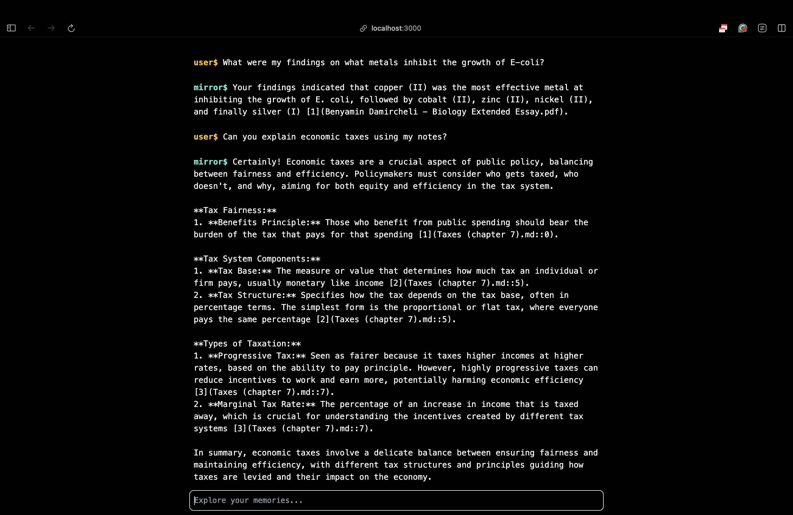
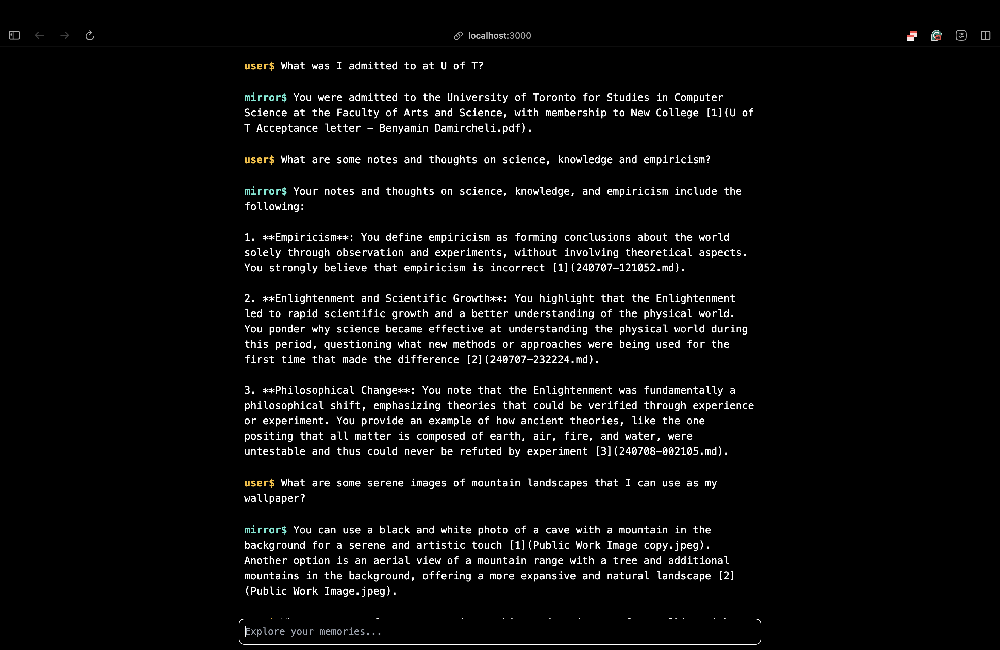
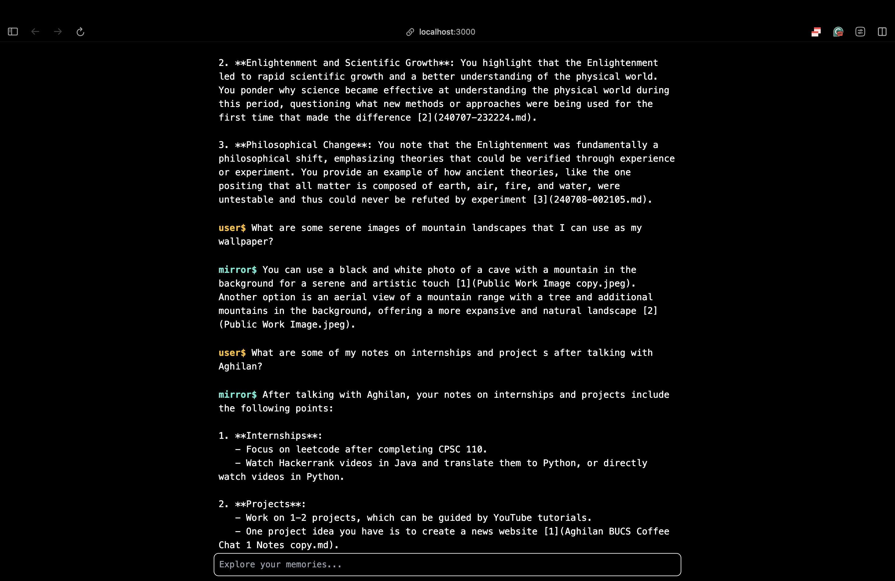

# Mirror

### Winner of "Best Use of AI" and "Best Productivity Hack" awards at 2024 NwHacks Hackathon.

Mirror is a self-hosted multimodal AI tool that can answer questions about all of your files, images, videos, audio and soon online search history and messages!

Mirror was something that I wish existed, so I built it.

### Examples

In the following examples, I am using mirror to summarize notes/thoughts that I have written, give me quick facts hidden in my files, recommend files to look at for when choosing my new wallpaper, and to answer uni coursework questions that follow exactly what my professor has taught us.

